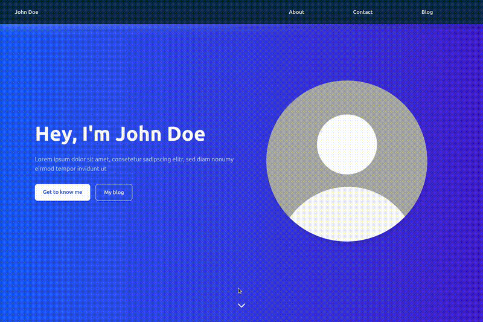
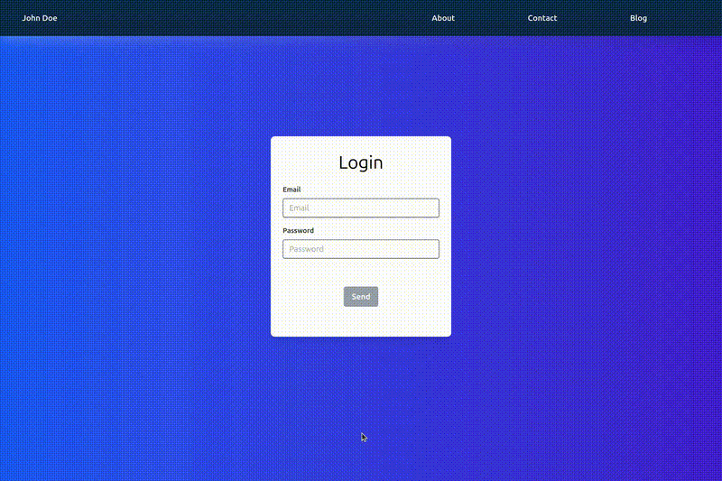

# Portfolio Website Template + Blog (Not working yet)


I've started this project because my brother was in need of a website that displays his resume, but in a more open and chilled down way compared to linkedin. Additionally, he wanted an integrated blog in order to have a motivation to write and publish financial articles. I've felt like open-sourcing the code so that anyone who would like to a have a portfolio website with a blog could have one. Btw, all text is written myself but I've run chatgpt to refine some of my spelling.

The landing page greets you with a nice hero section and below starts directly with a short non-formal introduction of yourself, what you do, your hobbies and anything else you'd like to tell about yourself.

Underneath that you can showcase your previous work experience and add anything you'd like. You can make it a linkedin-style bulletpoints-filled card or less formal with just text that comes to your mind. The last section is the academic record. Similar to the previous section.

Last there is the contact form. Anyone can contact you through this. Make sure to read the setup section to set this up. If you don't want or need this, you can simply remove it.



The blog section starts with a hero that you can use to tell about your reasons for creating the blog, what readers can expect or how often you will publish an article. After that your articles are listed that you can click on and read about certain articles. Once clicked you will land on the blog articles that is followed by a comment-section where users can write comments.


If you want to publish/modify an existing post you would need to login under localhost:PORT/login. Since the login was only meant for my brother, the email and password must match what is specified in backend/.env. After that you can simply create or modify a post, which is very simplistic and straight forward.



## Features (Summary)

- Portfolio-style landing page (hero, experience, education, contact)
- Integrated blog with comments
- Admin dashboard for creating and editing posts
- Authentication-protected login area
- Responsive design (mobile & desktop)

## Tech Stack

**Frontend**

- React
- Tailwind CSS

**Backend**

- Node.js / Express
- MongoDB
- JWT-based authentication

**DevOps**

- GitHub Actions (CI)
- Docker (optional, if applicable)

## 🚀 Getting Started

### Prerequisites

- Node.js -v 24.11
- npm
- Database (if running without docker)

### Installation

```bash
git clone https://github.com/amndzdzdz/portfolio-website-and-blog.git
cd portfolio-website-and-blog
```

### Setup

First you will need to fill out the .envs within the backend and frontend folder. Web3Forms is used to send emails and if you want to use still functionality, you will need to create an account (free tier) and input your web3forms key in the frontend .env.

Afterwards do the following:

```bash
cd frontend
npm install
npm run dev

cd backend
npm install
npm run dev
```

Or if you want to run in docker:

```bash
cd portfolio-website-and-blog
docker compose up
```

## Contributing

Contributions are welcome!

1. Fork the repository
2. Create a new branch
3. Commit your changes
4. Open a pull request
